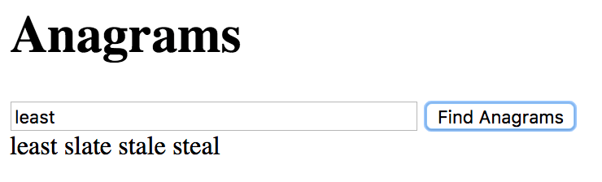

<em>24 - Extra: Anagramas Parte 1</em>

<h1>Extra: Anagramas Parte 1</h1>

<h2>Anagramas</h2>

Os anagramas são palavras formadas pelas mesmas letras, mas em ordem diferente.

Por exemplo, <em>"ator"</em> e <em>"tora"</em> são anagramas.

Há um dicionário de palavras em forma de array disponível em [palavras.js](https://files-kenzie-academy-brasil.s3.us-east-1.amazonaws.com/words-pt-br.js). <strong>NÃO CLIQUE NO LINK</strong>. Clique com o botão direito sobre o link, escolha "Save link as..." ou "Salvar link como" e aí sim salve-o em seu diretório anagrams1 como um novo arquivo chamado palavras.js que você salvará em sua pasta de projetos.

Você irá implementar uma função chamada getAnagramsOf(input) que pega um valor de entrada de texto de um campo de entrada em seu html, e retorna um array dos anagramas contidos no texto inserido. Por exemplo, a palavra "ator" digitada na caixa de texto deve retornar um array similar a ["ator", "rato", "tora", "rota"]. Você irá criar uma página com uma caixa de texto para digitar uma palavra e um botão que, quando clicado, irá disparar sua função getAnagramsOf para encontrar todas as palavras do dicionário que forem anagramas do texto inserido.

<h2>Início</h2>

Crie um novo diretório chamado anagrams1 para este projeto. Crie um arquivo index.html e um arquivo anagrams1.js. Faça o commit e o push desses arquivos para um novo repositório no GitLab. <strong>É importante seguir as instruções para os nomes para que os testes funcionem.</strong>

Você precisará incluir o arquivo palavras.js como um script. Adicione em seu arquivo html a seguinte tag de script para ele:

```
<script type="text/javascript" src="palavras.js"></script>
```

E em seguinda faça a inclusão da tag de script para o anagrams1.js em seu arquivo html:

```
<script type="text/javascript" src="anagrams1.js"></script>
```

Lembre-se também de adicionar o arquivo ao seu repositório git.

Em seguida, você precisará de um modo que o usuário possa inserir o texto. O seguinte trecho de HTML define uma caixa de texto e um botão:

```
<div>
  <input type="text" id="input" size="40" />
  <button id="findButton">Encontrar Anagramas</button>
</div>
```

Isoladamente, seu botão não faz nada. Você irá atribuir uma função de handler de clique que será executada quando ele for clicado:

```
const button = document.getElementById("findButton");
button.addEventListener("click", function () {
  // seu código vai aqui
});
```

Dentro da função handler de vlique, você precisará de um modo de acessar o conteúdo digitado na caixa de texto quando o botão for clicado. Então você pode passar o conteúdo para sua função getAnagramsOf como argumento:

```
button.addEventListener("click", function () {
  let typedText = document.getElementById("input").value;
  getAnagramsOf(typedText);
});
```

<h2>Detectando Anagramas</h2>

Você precisa de um modo de testar se duas strings contém as mesmas letras em ordem diferente.

Considere o efeito de ordenar as letras alfabeticamente. Isso coloca as letras na ordem padrão, independentemente de como elas são originalmente ordenadas nas palavras. Aqui há uma função que você pode usar para realizar isso:

```
function alphabetize(a) {
  return a.toLowerCase().split("").sort().join("").trim();
}
```

Veja o efeito de aplicar a função alphabetize a algumas palavras:


alphabetize("ator") retorna "aort"

alphabetize("rota") retorna "aort"

alphabetize("tora") retorna "aort"

alphabetize("rato") retorna "aort"

alphabetize("sapo") retorna "aops"

alphabetize("sopa") retorna "aops"


As formas ordenadas alfabeticamente são as mesmas para cada palavra em um conjunto de anagramas. Tanto "sapo" quanto "sopa" formam "aops" quando são ordenadas alfabeticamente. Similarmente, "ator", "rota" e "tora" ficam iguais quando são ordenadas alfabeticamente. Portanto, você pode usar esta função alphabetize para ajudá-lo a determinar se duas palavras são anagramas.

Depois de obter seu array de resultados, em sua função, crie um novo Elemento e defina seu textContent = seu array de resultados. Em seguida, use document.body.appendChild() para adicionar seu novo elemento à página. Por último, use return para retornar o array de resultados.

<h2>Exemplo concluído</h2>

Aqui está uma captura de tela de uma implementação concluída:



<h2>Envio</h2>

Faça o push e implemente seu código no Gitlab. Adicione grupo ka-br-<sua-turma>-correcoes como membro do seu projeto com a permissão "Reporter", e envie a url do seu gitlab pages (Ex: https://nomedeusuario.gitlab.io/anagrams1).